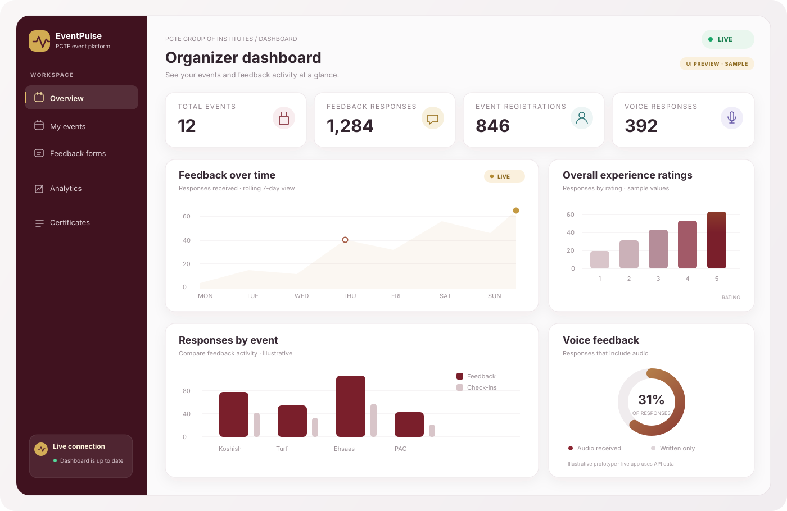

<div align="center">



<h1>EventPulse</h1>

### One connected platform for every event, attendee, and insight.

Plan PCTE festivals, welcome participants, collect thoughtful feedback, and see
what is happening — as it happens.

<p>
  <a href="https://github.com/ZahikAbasdar/Event-Pulse"></a>
  
  
  
</p>

[Explore the platform](#-the-experience) ·
[Get started](#-run-eventpulse-locally) ·
[See the analytics prototype](#-live-analytics-at-a-glance) ·
[Open the live app](https://eventpulse-9fpd.onrender.com)

</div>

---

## ✨ The experience

EventPulse brings the public event experience and the organizer's control room
into one responsive application. Its PCTE-inspired visual system pairs maroon
and gold with glass-style surfaces, original local event illustrations, and a
live dashboard.

| 🎟️ For participants | 📊 For organizers | 🛡️ For administrators |
|---|---|---|
| Discover festivals and competitions, create an account with email and password, register for events, and access QR tickets and certificates. | Publish public feedback forms, share QR codes, review audio responses, and monitor event activity in real time. | Manage organization data and roles, review audit activity, and use protected administrative tools. |

**Live deployment:** [eventpulse-9fpd.onrender.com](https://eventpulse-9fpd.onrender.com)

Participant and staff accounts use email and password. Phone numbers are optional profile information; SMS/OTP sign-in is not used.

> **Visual prototype:** the illustrations below are original, locally stored
> SVGs designed for this README. They depict the app's UI and chart types; they
> are explanatory prototypes, not screenshots or sample analytics from a live
> production database.

## 📈 Live analytics at a glance

The organizer overview visualizes feedback trends, event comparisons, ratings,
and voice responses. Socket.IO pushes a refresh as new feedback arrives, with a
20-second polling fallback.

<div align="center">



*An animated, original dashboard prototype — the real organizer dashboard is
powered by live application data.*

</div>

| 📈 Response trend | 📊 Feedback by event | ⭐ Rating breakdown | 🎙️ Voice coverage |
|---|---|---|---|
| See submissions over time. | Compare the events people responded to. | Understand the response distribution. | Track responses that include voice feedback. |

## 🎭 Made for the PCTE events experience

Event cards use artwork bundled with the app and the user-provided Jasmine
Sandlas poster. Organizers can upload authorized event photos from the
dashboard. PCTE gallery media is not scraped or copied from third-party sites.

<div align="center">



*Festival cover-art concept previews — bundled artwork is illustrative unless
an organizer has uploaded an authorized event photograph.*

</div>

**Explore:** [Events](https://github.com/ZahikAbasdar/Event-Pulse) ·
[Koshish](https://pcte.edu.in/life/koshish) ·
[Turf](https://pcte.edu.in/life/turf) ·
[Ehsaas](https://pcte.edu.in/life/ehsaas) ·
[PCTE Photo Tour](https://pcte.edu.in/photo-tour)

## 💎 What ships in the app

<details open>
<summary><strong>Events, communities & tickets</strong></summary>

- Six PCTE communities: Debate Society, Koshish, Turf, Ehsaas, PAC, and STEM.
- Searchable and filterable public events and event details.
- Koshish competition listings with rules, team sizes, timing, and scoring.
- Event registration, QR tickets, capacity limits, and idempotent staff
  check-in.
- Uploadable cover images and locally bundled artwork as a fallback.

</details>

<details>
<summary><strong>Email/password sign-in & roles</strong></summary>

- Participants and staff sign in with their email and password.
- Participants can self-register; privileged staff roles must be invited or promoted by an admin.
- Role- and organization-protected API routes and dashboard pages.

</details>

<details>
<summary><strong>Public feedback, QR forms & voice</strong></summary>

- Ten event-specific questions for generated event feedback forms.
- Public share links and QR codes; feedback submission does not require login.
- Participant fields for name, roll number, class, batch, block, phone, and
  email.
- Optional voice feedback stored outside the public uploads folder and
  available to authorized organizers.
- Feedback analytics refreshed by live events and fallback polling.
- Persistent production storage and backups must be configured by the
  deployment owner; see [recording storage](#-voice-feedback-storage).

</details>

<details>
<summary><strong>More tools for the event team</strong></summary>

- Competition teams, judging and scoring APIs, fixtures, brackets, and
  leaderboards.
- PDF certificate generation and volunteer assignment tracking.
- Organizer and participant notifications with Socket.IO.
- Image and video gallery uploads.
- Student records and CSV/Excel analysis.
- Admin console, audit logging, and EventPulse AI chat surfaces.
- Optional official YouTube channel video listings through the YouTube Data
  API.

</details>

## 🧱 Built with

| Layer | Technology |
|---|---|
| Web application | React 18, Vite, Tailwind CSS, Recharts |
| API | Node.js, Express, JWT, express-validator |
| Persistence | MongoDB, Mongoose |
| Real-time updates | Socket.IO |
| Event artwork | Original local SVG covers and authorized image uploads |
| Optional integrations | Twilio Verify, YouTube Data API, SMTP, AI provider |

## 🚀 Run EventPulse locally

### Prerequisites

- Node.js 18 or later
- MongoDB running locally or an Atlas connection string
- Twilio Verify credentials to send real participant sign-in/sign-up SMS

### 1. Configure the backend

```powershell
cd backend
Copy-Item .env.example .env
```

Edit `backend/.env`. Set a strong `JWT_SECRET`, `COOKIE_SECRET`, and initial
owner credentials (`OWNER_NAME`, `OWNER_EMAIL`, `OWNER_PASSWORD`). Set
`MONGO_URI` to your MongoDB database.

Install dependencies and initialize the PCTE data:

```powershell
npm install
npm run seed
npm run dev
```

> **Seed warning:** `npm run seed` clears and recreates seeded organization,
> event, society, competition, and user collections. Do not run it against a
> database containing data you need to preserve.

For an existing database, add/update only the Jasmine Sandlas Festaweek event
and feedback form without resetting other collections:

```powershell
npm run seed:jasmine
```

### 2. Start the frontend

In a second terminal:

```powershell
cd frontend
npm install
npm run dev
```

Open the Vite URL printed in the terminal (normally
[`http://localhost:5173`](http://localhost:5173)). Vite proxies API and
Socket.IO requests to `http://localhost:5000`. If your API uses another URL,
set `VITE_API_PROXY_TARGET` before starting Vite.

### 3. Sign in

- **Organizer/staff:** use the owner email and password configured in
  `backend/.env`.
- **Participant:** create an account using an email address and a password of at
  least eight characters. Phone and academic profile details are optional.
- **Public feedback:** open an organizer-generated link or scan its QR code;
  participants do not need to sign in.

## ☁️ Deploy to Render + MongoDB Atlas

The repository includes [`render.yaml`](render.yaml), which configures a
single-origin Render web service: Express serves the built React app, the API,
and Socket.IO from the same URL. Render's free compute filesystem is
ephemeral, so uploaded event media and voice feedback are saved in Supabase
Storage rather than on the app server. Configure MongoDB Atlas and Supabase
before creating the Render Blueprint.

[](https://render.com/deploy?repo=https://github.com/ZahikAbasdar/Event-Pulse)

1. Create an Atlas cluster and database user. In Atlas Network Access, allow
   the outbound IP ranges shown for your Render service; avoid opening database
   access to the entire internet where possible. Copy the Atlas connection URI
   and substitute the database user's password safely.
2. Create a Supabase project and two Storage buckets:
   - `eventpulse-media` — **public** bucket for authorized event photos/videos.
   - `eventpulse-voice` — **private** bucket for participant voice recordings.

   Copy the project's URL and **service role/secret key**. The key is a
   backend-only secret and must never be sent to the browser or added to Git.
3. In Render, choose **New → Blueprint**, connect this GitHub repository, and
   deploy the `render.yaml` blueprint from the `main` branch.
4. Add the requested private environment values in Render's dashboard:
   `MONGO_URI`, `OWNER_NAME`, `OWNER_EMAIL`, `OWNER_PASSWORD`,
   `SUPABASE_URL`, and `SUPABASE_SERVICE_ROLE_KEY`. Render generates
   `JWT_SECRET` and `COOKIE_SECRET`. Never put secrets in Git or in
   client-side variables.
5. Wait for the build and `/api/health` health check to pass. Use the HTTPS
   service URL Render assigns to the service. Render's external URL is used
   automatically for CORS and Socket.IO.
6. Initialize the empty production database exactly once from the Render
   service Shell:

   ```bash
   npm run seed --prefix backend
   ```

   The seed uses the Render `OWNER_*` values. It **deletes and recreates**
   seeded PCTE collections; never run it to update a database with data that
   must be preserved. For a populated database, use the non-destructive
   `npm run seed:jasmine --prefix backend` only if that event update is needed.
7. Verify the live URL, participant registration and sign-in, organizer login,
   feedback QR link, media upload, and Socket.IO updates.

The free tiers have provider-defined quotas and availability limits. Monitor
Supabase storage usage and keep independent backups of important recordings.
The application has no recording deletion endpoint, but no free cloud tier is
a guarantee of unlimited storage or availability. Render, MongoDB Atlas,
and Supabase account setup and billing are controlled by their providers; this
repository cannot create those accounts or enter account secrets for you.

## 🎙️ Voice feedback storage

With Supabase configured, voice recordings are stored in the private
`eventpulse-voice` bucket and are streamed only through the authorized
organizer endpoint. The application has no recording-deletion endpoint or
automatic cleanup. Local development without Supabase stores audio in
`backend/private/feedback-audio`. **Cloud storage is not a backup:** operators
must monitor quotas, verify backups and restore procedures, protect access to
recordings, and establish an appropriate privacy and retention policy for
participant information.

## 🔐 Other optional integrations

| Capability | Environment variables | If not configured |
|---|---|---|
| YouTube channel video listings | `YOUTUBE_API_KEY` | The official channel/playlist embeds remain available; API-populated video cards are disabled. |
| AI-assisted tools | `AI_PROVIDER_API_KEY`, optional `AI_PROVIDER_BASE_URL` | Provider-backed AI answers are unavailable. |
| Certificate email delivery | `SMTP_HOST`, `SMTP_USER`, `SMTP_PASS`, optional `SMTP_PORT`/`SMTP_FROM` | Generated certificates remain downloadable but are not emailed. |
| Persistent media/audio storage | `SUPABASE_URL`, `SUPABASE_SERVICE_ROLE_KEY`, optional bucket names | Local development falls back to local disk; production refuses to start without remote storage. |
| Public/proxied deployment | `CLIENT_URL` (optional) | Render's service URL is detected automatically; set this only for a custom domain/proxy. |

All backend configuration belongs in the ignored local `backend/.env` file.
See [`backend/.env.example`](backend/.env.example) for the full template.

## 🗺️ App map

| Route | Experience |
|---|---|
| `/` | EventPulse landing page |
| `/events` | Browse events |
| `/events/:slug` | Event details and registration |
| `/events/:slug/competitions/:compSlug` | Competition details and rules |
| `/events/:slug/competitions/:compSlug/leaderboard` | Public leaderboard |
| `/societies` · `/societies/:slug` | PCTE communities |
| `/feedback/:shareSlug` | Public, no-login feedback form |
| `/dashboard` | Organizer overview and live charts |
| `/dashboard/forms` | Generate and share feedback forms |
| `/dashboard/analytics/feedback` | Feedback analysis |
| `/dashboard/admin` | Organization administration |
| `/my/tickets` · `/my/certificates` | Participant passes and certificates |

## 🧪 API quick reference

| Method | Endpoint | Purpose |
|---|---|---|
| `GET` | `/api/health` | API health |
| `POST` | `/api/auth/register` | Create a participant account with email and password |
| `POST` | `/api/auth/login` | Sign in with email and password |
| `GET` | `/api/events` | Discover published events |
| `POST` | `/api/events/:eventId/register` | Register for an event |
| `GET` | `/api/dashboard/organizer/charts` | Organizer analytics data |
| `POST` | `/api/forms/event-feedback/ensure` | Ensure event feedback forms |
| `GET` | `/api/forms/share/:shareSlug` | Load a public feedback form |
| `POST` | `/api/forms/share/:shareSlug/responses` | Submit public feedback |
| `GET` | `/api/youtube/videos` | Optional official channel uploads |

See [`backend/routes/`](backend/routes/) for the complete route definitions.

## 🛠️ Current product notes

- Judges can submit scores via the API, but there is not yet a dedicated
  judge-scoring form page.
- Organizer event-management screens are limited; some event fields are
  managed through the API/seed process.
- Webhook registration exists; event-triggered webhook dispatch is not yet
  wired.
- Event cards show bundled illustrations until an authorized event cover image
  is uploaded.
- A YouTube Data API key is optional; official YouTube embeds do not require
  the key.

## 🤝 Contributing

1. Fork the repository and create a focused feature branch.
2. Configure local environment variables; never commit `.env` files,
   credentials, recordings, or participant data.
3. Install the backend and frontend dependencies and build the frontend:

   ```powershell
   cd frontend
   npm install
   npm run build
   ```

4. Describe the change and verification performed in your pull request.

## 📜 License & media

No project license is currently included; ask the repository owner before
redistributing the source. Event artwork and the supplied performance poster
are for this project's preview. Obtain permission before publishing
institutional photographs or other third-party media. The app does not scrape
PCTE or social-media websites.

---

<div align="center">

**Made for the moments that bring a campus together.**

[Back to top](#eventpulse) ·
[PCTE Group of Institutes](https://pcte.edu.in/) ·
[Repository](https://github.com/ZahikAbasdar/Event-Pulse)

</div>
